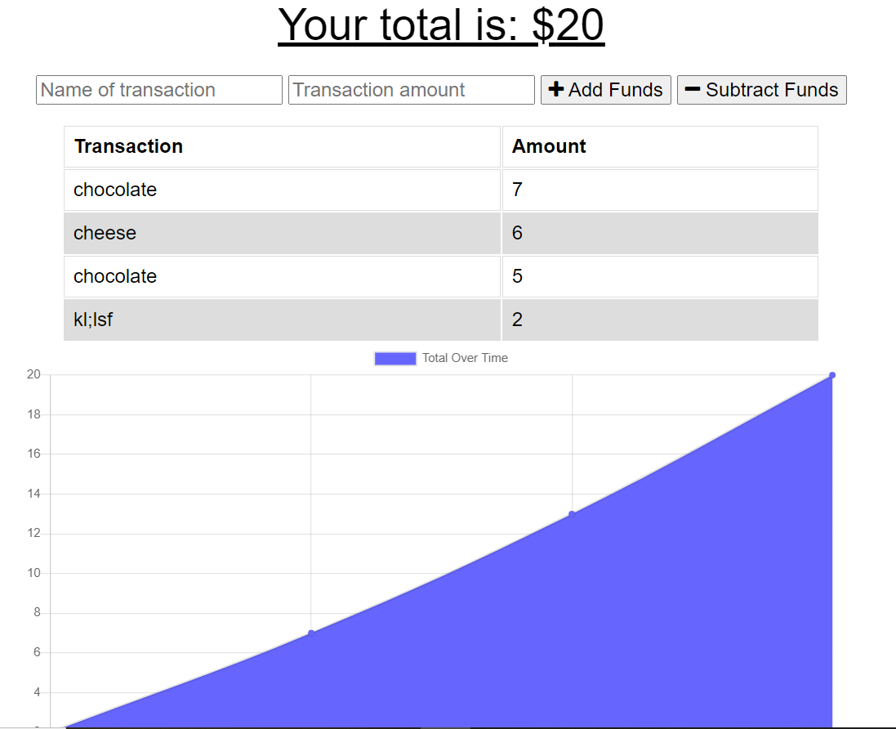

# IndexedDB Budget Tracker App

## Description

A progressive web application where the user can add expenses and deposits to their budget. This application works both with or without an internet connection and populates the information once the user is back online. This application provides the user a fast and easy to track withdrawals and deposits.

# Table of Contents

- [Description](#Description)
- [Table of Contents](#Table-Of-Contents)
- [Installation](#Installation)
- [Usage](#Usage)
- [Contributing](#Contributing)
- [License](#License)
- [Tests](#Tests)

## Installation

Use the package managers

- [compression] (https://www.npmjs.com/package/compression)
- [express] (http://expressjs.com/)
- [lite-server] (https://www.npmjs.com/package/server-lite)
- [mongoose] (https://www.npmjs.com/package/mongoose)
- [morgan] (https://www.npmjs.com/package/morgan)

```bash
npm install dependencies
```

## Usage

```compression, express, lite-server, mongoose, morgan
import compression, express, lite-server, mongoose, morgan
npm install to install dependencies
```



## Contributing

pull requests are welcome, but requests are a necessity before you make changes.

## License

[MIT](https://opensource.org/licenses/MIT)

## Tests

N/A

## Questions

For more info, click here:
https://github.com/halowe94
